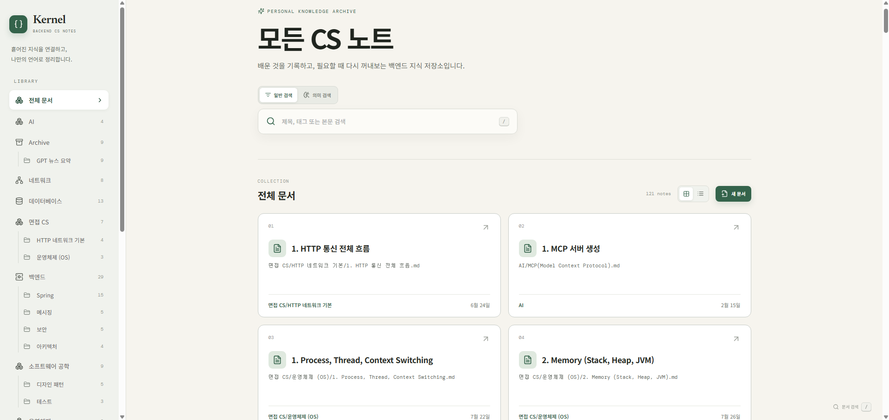
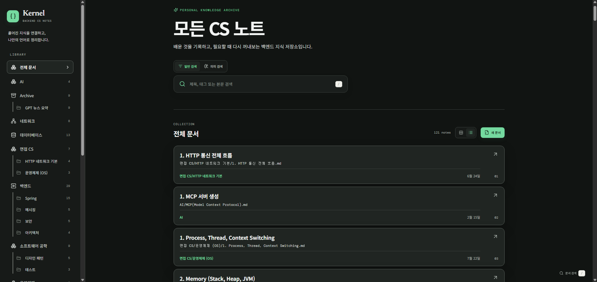
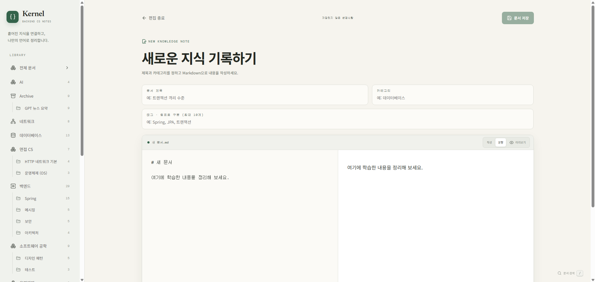
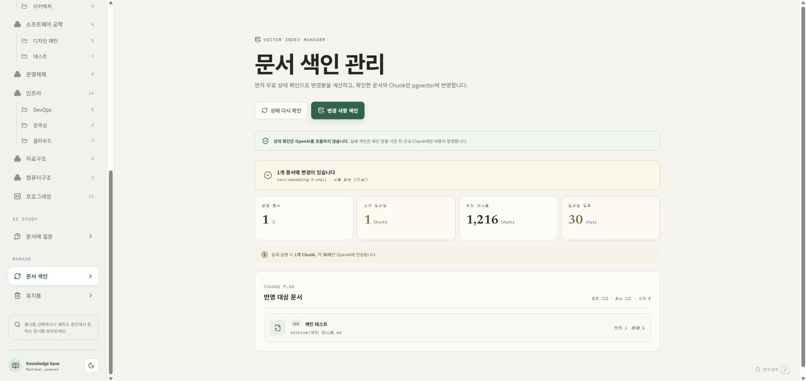
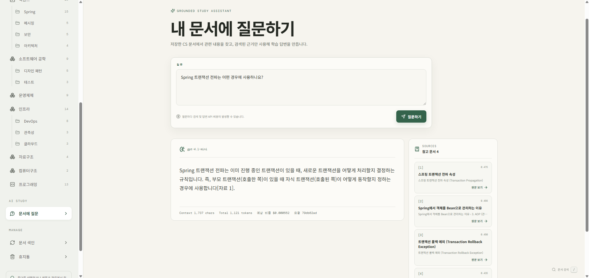

# CS Notes

> **기록한 CS 지식을 의미 검색하고, 내 문서를 근거로 AI와 복습하는 개인 학습 서비스**

Markdown 문서를 단순히 모아두는 데서 그치지 않고, **기록 → 정리 → 검색 → 질문 → 복습**으로 이어지는 학습 흐름을 하나의 화면에서 제공합니다.

| Light mode | Dark mode |
| :---: | :---: |
|  |  |

## 핵심 학습 흐름

| 단계 | 무엇을 하나요? |
| --- | --- |
| **01 기록** | 학습한 내용을 Markdown으로 작성합니다. |
| **02 정리** | 폴더와 태그로 문서를 분류합니다. |
| **03 색인** | 변경된 문서만 선별해 벡터로 저장합니다. |
| **04 검색** | 키워드 검색과 의미 검색으로 필요한 내용을 찾습니다. |
| **05 복습** | 내 문서를 근거로 AI에게 질문하고 출처를 확인합니다. |

## 주요 기능

### 01. 내 언어로 기록

**작성한 내용은 로컬 Markdown 파일로 유지됩니다.**

화면에서 제목, 폴더, 태그와 본문을 입력해 새 문서를 만들고 기존 문서를 수정할 수 있습니다. 특정 서비스의 데이터 형식에 종속되지 않아 저장소의 문서를 그대로 관리할 수 있습니다.



### 02. 구조적으로 탐색

**실제 폴더 계층과 태그를 기준으로 문서를 구분합니다.**

백엔드, 데이터베이스, 운영체제 같은 상위 주제와 그 아래의 Spring, 보안, DevOps 같은 하위 폴더를 함께 보여줍니다. 삭제한 문서는 휴지통에서 복원하거나 영구 삭제할 수 있습니다.

### 03. 변경된 문서만 색인

**색인 전에 비용 없이 변경 범위와 예상 입력량을 확인합니다.**

`문서 색인` 화면은 Markdown과 PostgreSQL의 저장 상태를 비교해 다음 내용을 미리 보여줍니다.

- **변경 문서** — 신규·수정·삭제된 문서
- **신규 Chunk** — OpenAI 임베딩이 필요한 Chunk
- **재사용 Chunk** — 기존 벡터를 그대로 사용할 수 있는 Chunk
- **예상 입력량** — OpenAI로 전송될 전체 문자 수

내용과 Chunk가 기존 색인 상태와 같으면 임베딩을 다시 요청하지 않습니다. 사용자가 `변경 사항 색인`을 실행한 경우에만 실제 API 호출이 발생합니다.



### 04. 키워드 또는 의미로 검색

**정확한 단어를 알 때는 일반 검색, 개념만 기억날 때는 의미 검색을 사용합니다.**

일반 검색은 제목·본문·태그에서 일치하는 단어를 찾습니다. 의미 검색은 질문과 가까운 문서 Chunk를 찾아 관련 섹션, 내용 미리보기와 관련도 점수를 표시하며 결과에서 원문으로 바로 이동할 수 있습니다.

### 05. 내 문서와 함께 복습

**AI 답변과 함께 근거가 된 원문을 확인합니다.**

질문과 가까운 Chunk를 pgvector에서 검색하고, 검색된 내용만 OpenAI 채팅 모델의 context로 전달합니다. 답변에는 출처 문서가 함께 표시되며, 관련 근거를 찾지 못하면 문서에 없는 내용을 추측해 답하지 않습니다.



## 서비스 동작 방식

```text
React + Vite
      │
      │ REST API
      ▼
Spring Boot
      ├── 로컬 Markdown ───────── 문서 작성·조회·검색
      ├── PostgreSQL + pgvector ─ Chunk·임베딩 저장 및 유사도 검색
      └── OpenAI ──────────────── 임베딩 및 문서 기반 답변 생성
```

문서는 제목 구조를 고려해 Chunk로 나뉩니다. 각 Chunk의 임베딩은 pgvector에 저장되고, 의미 검색 시 질문 벡터와의 **cosine 유사도**로 관련 내용을 찾습니다. RAG 답변은 이 검색 결과만 참고 자료로 사용합니다.

## 비용 방어 장치

> OpenAI API 키를 등록하거나 서버를 실행하는 것만으로는 비용이 발생하지 않습니다. **문서 색인, 의미 검색 또는 RAG 답변을 실제로 요청할 때만 API가 호출됩니다.**

- 색인 전에 API를 호출하지 않는 미리보기를 제공합니다.
- 변경되지 않은 Chunk의 임베딩을 재사용합니다.
- 한 번에 색인할 문서 수, Chunk 수와 문자 수를 제한합니다.
- 동일한 검색과 답변을 일정 시간 캐시합니다.
- 답변 출력 토큰과 일일 예상 비용을 제한합니다.
- 질문 원문은 저장하지 않고 해시와 사용량 정보만 기록합니다.

## 기술 구성

| 영역 | 기술 |
| --- | --- |
| **Frontend** | React 19, TypeScript, Vite, TanStack Query |
| **Backend** | Java 21, Spring Boot 3, Spring AI, Gradle Kotlin DSL |
| **Document** | Markdown, YAML front matter |
| **RAG storage** | PostgreSQL, pgvector, Flyway |
| **AI** | OpenAI Embedding API, OpenAI Chat API |

<details>
<summary><strong>로컬 실행 방법 보기</strong></summary>

### 기본 문서 기능

PostgreSQL과 OpenAI API 키 없이 실행할 수 있습니다. Java 21과 Node.js 20.19 이상이 필요합니다.

```powershell
# backend
./gradlew.bat :apps:backend:bootRun

# frontend (별도 터미널)
cd apps/frontend
npm install
npm run dev
```

브라우저에서 `http://localhost:5173`으로 접속합니다.

### RAG 기능

PostgreSQL을 실행하고 같은 터미널 세션에 환경 변수를 설정한 뒤 백엔드를 시작합니다.

```powershell
docker compose up -d postgres

$env:OPENAI_API_KEY = "발급받은 API 키"
$env:RAG_PERSISTENCE_ENABLED = "true"
$env:RAG_INDEXING_ENABLED = "true"
$env:RAG_SEARCH_ENABLED = "true"
$env:RAG_ANSWER_ENABLED = "true"

./gradlew.bat :apps:backend:bootRun
```

API 키는 저장소나 설정 파일에 기록하지 않습니다. 기본 일일 RAG 답변 예상 비용 한도는 `$0.25`이며, 실제 청구 금액은 OpenAI 사용량 대시보드를 기준으로 확인해야 합니다.

</details>

## 프로젝트 방향

> **많이 보관하는 것보다, 다시 찾고 내 것으로 만드는 과정을 짧게 만듭니다.**

```text
학습 → 내 언어로 기록 → 필요한 내용 검색 → 근거와 함께 복습 → 문서 보완
```

향후에는 학습 기록과 복습 주기, 문서 간 연결을 추가해 지속적으로 활용할 수 있는 개인 CS 학습 환경으로 발전시키는 것을 목표로 합니다.
