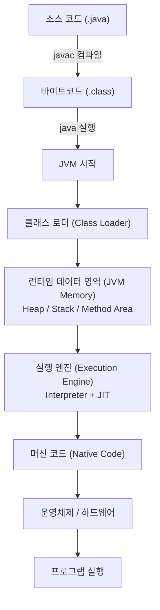

# 자바 프로그램 실행 흐름 (Java Execution Flow)

자바 프로그램은 **작성(Write) -> 컴파일(Compile) -> 실행(Run)** 의 3단계를 거쳐 작동함

## 1. 전체 흐름도 (Flowchart)

---

## 2. 단계별 상세 설명

### Step 1: 컴파일 타임 (Compile Time)
*   **무엇을 하나요?** 사람이 이해하는 자바 언어를 기계(JVM)가 이해할 수 있는 언어로 번역함
*   **주요 도구**: `javac` (Java Compiler)
*   **결과물**: `.class` 파일 (바이트 코드)
    > **바이트 코드란?**
    > OS(Windows, Linux 등)에 상관없이 JVM만 있으면 실행 가능한 중간 언어. "Write Once, Run Anywhere"의 핵심

### Step 2: 런타임 (Run Time) - JVM의 동작
프로그램을 실행하면 JVM이 작동을 시작함

#### ① 클래스 로딩 (Class Loading)
*   **언제?** 프로그램 실행 중 해당 클래스가 **처음 필요할 때**
*   **누가?** **Class Loader**
*   **하는 일**:
    1.  `.class` 파일을 찾아 읽어옴 (**Loading**)
    2.  파일이 올바른지 검증하고, static 변수의 메모리를 할당함 (**Linking**)
    3.  static 변수 값을 초기화하고 static 블록을 실행함 (**Initialization**)

#### ② 메모리 적재 (Runtime Data Area)
JVM은 OS로부터 메모리를 할당받아 용도별로 나누어 사용함

| 영역 | 설명                                        | 공유 여부 |
| :--- |:------------------------------------------| :--- |
| **Method Area** | 클래스 정보, static 변수, 상수 등이 저장됨              | 모든 스레드 공유 |
| **Heap Area** | `new`로 생성된 **객체(Instance)** 가 저장됨 (GC 대상) | 모든 스레드 공유 |
| **Stack Area** | 메서드 호출 시 지역변수, 매개변수 등이 저장됨                | 스레드별 독립 |
| **PC Register** | 현재 실행 중인 명령어 주소를 가리킴                      | 스레드별 독립 |
| **Native Stack** | C/C++ 등 외부 언어 호출 시 사용                     | 스레드별 독립 |

#### ③ 실행 (Execution)
메모리에 로드된 바이트 코드를 **Execution Engine**이 기계어로 변환하여 실행함

*   **인터프리터 (Interpreter)**: 코드를 한 줄씩 읽고 실행함 (초기 실행 속도 빠름)
*   **JIT 컴파일러 (Just-In-Time)**: 자주 실행되는 코드(Hotspot)를 통째로 기계어로 변환해 캐싱함 (반복 실행 속도 매우 빠름)
*   **GC (Garbage Collector)**: 더 이상 안 쓰는 객체(Heap 영역)를 청소함

---

## 3. 핵심 Q&A

**Q. 왜 자바는 컴파일 언어이면서 인터프리터 언어인가요?**
*   자바는 소스 코드를 전체 컴파일하여 `.class` 파일을 만들지만(컴파일 언어 특징),
*   실행 시에는 JVM이 이 `.class` 파일을 한 줄씩 읽거나 JIT로 변환하며 실행하기 때문 (인터프리터 언어 특징)
*   이 덕분에 **플랫폼 독립성**과 **성능 최적화**를 동시에 얻을 수 있음

**Q. 동적 로딩(Dynamic Loading)이 왜 좋은가요?**
*   게임 로딩 화면을 생각해보면, 모든 맵과 캐릭터를 처음에 다 로딩하면 게임 켜는 데 1시간이 걸릴지도 모름
*   자바는 **필요한 순간에 필요한 클래스만** 메모리에 올림. 덕분에 초기 실행 속도가 빠르고 메모리를 효율적으로 쓸 수 있음
